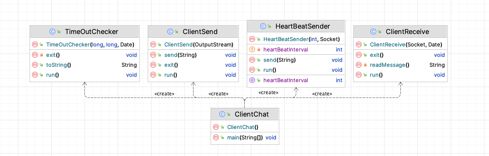

# SR03 Devoir 1 Socket Rapport

## Membres du Projet

- Houze ZHANG: **houze.zhang@etu.utc.fr**
- Bingqian SHU: **bingqian.shu@etu.utc.fr**

## Encadrants

- Ahmed Lounis
- Cédric Martinet

<!-- <div STYLE="page-break-after: always;"></div> -->

##  Sommaire

- [SR03 Devoir 1 Socket Rapport](#sr03-devoir-1-socket-rapport)
  - [Membres du Projet](#membres-du-projet)
  - [Encadrants](#encadrants)
  - [Sommaire](#sommaire)
  - [1. Contexte](#1-contexte)
  - [2. Conception et réalisation](#2-conception-et-réalisation)
    - [2.1 UML](#21-uml)
      - [Serveur](#serveur)
      - [Client](#client)
    - [2.2 Établissement de connexion](#22-établissement-de-connexion)
    - [2.3 Chat](#23-chat)
      - [2.3.1 Broadcast](#231-broadcast)
      - [2.3.2 Unicast](#232-unicast)
    - [2.4 Fermeture et Exception](#24-fermeture-et-exception)
      - [2.4.1 “EXIT” indiqué par le client](#241-exit-indiqué-par-le-client)
        - [Serveur](#serveur-1)
        - [Client](#client-1)
      - [2.4.2 Appel système](#242-appel-système)
        - [Serveur](#serveur-2)
        - [Client](#client-2)
      - [2.4.3 Exception dans le cadre d’exécution distribuée](#243-exception-dans-le-cadre-dexécution-distribuée)
        - [Présentation du problème](#présentation-du-problème)
        - [Idées de mise en œuvre du pack Heartbeat et comparaison](#idées-de-mise-en-œuvre-du-pack-heartbeat-et-comparaison)
        - [Idée 1 : Combiner l'envoi et la réception de paquets heartbeat sur un thread existant (échec)](#idée-1--combiner-lenvoi-et-la-réception-de-paquets-heartbeat-sur-un-thread-existant-échec)
        - [Idée 2 : NIO (Java NewIO) remplace IO (à essayer)](#idée-2--nio-java-newio-remplace-io-à-essayer)
        - [Idée 3 : Thread démon (mise en œuvre réussie)](#idée-3--thread-démon-mise-en-œuvre-réussie)
    - [2.5 Stratégie d'amélioration de la performance](#25-stratégie-damélioration-de-la-performance)
      - [2.5.1 Structure de données](#251-structure-de-données)
      - [2.5.2 Bloc de synchronisation](#252-bloc-de-synchronisation)
    - [2.6 Méthodes de génie logiciel](#26-méthodes-de-génie-logiciel)
      - [2.6.1. Transfert de jetons](#261-transfert-de-jetons)
  - [3. Exécution](#3-exécution)
    - [3.1. Environnement de essai](#31-environnement-de-essai)
      - [Serveur](#serveur-3)
      - [Client](#client-3)
    - [3.2. Broadcast et Unicast](#32-broadcast-et-unicast)
      - [3.2.1. Broadcast](#321-broadcast)
      - [3.2.2. Unicast](#322-unicast)
    - [3.3. Exception](#33-exception)
      - [3.3.1. Sortie normale avec EXIT](#331-sortie-normale-avec-exit)
        - [Client](#client-4)
        - [Serveur](#serveur-4)
      - [3.3.2. Sortie anormale avec CTRL+C](#332-sortie-anormale-avec-ctrlc)
        - [Client](#client-5)
        - [Serveur](#serveur-5)
      - [3.3.3. Exception du réseau](#333-exception-du-réseau)
        - [Client](#client-6)
        - [Serveur](#serveur-6)

<div STYLE="page-break-after: always;"></div>

## 1. Contexte

Le devoir 1 de l’UV SR03 consiste à développer une application de chat Client/Serveur via les sockets qui permet d’organiser une discussion publique entre un ensemble de participants dans laquelle les messages sont de type broadcast (et éventuellement une discussion privée de type unicast)

Un serveur centralisé s’occupe de toutes les transmissions de messages en exécutant une boucle infinie de détection de nouvelle connexion et en lançant pour chaque client un thread dédié à l’envoi, la réception et le traitement des messages. Il stocke tous les sockets de communication dans un Hashtable en ajoutant un identifiant (pseudo) unique pour chaque client.

Lorsque le serveur reçoit un message dans l’un des sockets de communication, le thread de ce socket réagit en récupérant ce message et en diffusant son contenu sur l’ensemble des objets socket stockés dans le Hashtable. De la même manière, s’il s’agit d’un message (commençant par @ et suivi par le pseudo de récepteur), le serveur cherche dans son tableau le récepteur correspondant et envoyer ce message vers le socket de ce correspondant.

Les clients disposent de deux threads. Une pour lecture de message provenant du serveur, et l’autre pour l’écriture des messages.

Après l’établissement de la connexion, le tout premier message provenant du serveur indique la saisie d’un pseudo. L’utilisateur choisira un pseudo non-doublon pour accéder à la salle de discussion. Tous les messages qu’il parvenait au serveur après sont des messages de communication.

Pour quitter la salle, l’utilisateur termine le programme directement dans la console ou envoyer un message “exit” au serveur. Le serveur retourne au client ensuite un message d’acquittement indiquant que la demande de terminaison de discussion a été prise en compte. Les sockets appartenant à ce client seront détruit automatiquement côté client et côté serveur.

Un mécanisme de détection de connexion a été également mis en place. Ceci consiste à imposer le thread écriture du côté client à envoyer périodiquement un message de vérification de connexion. Si le serveur ne reçoit pas ce message de la part de client après une longue période de temps, la connexion sera automatiquement interrompue.

<div STYLE="page-break-after: always;"></div>

## 2. Conception et réalisation

### 2.1 UML

#### Serveur


La classe ServeurChat est un thread personnalisé pour le côté serveur. Une fois que le processus côté serveur est lancé, le thread principal ouvre un thread TimeOutChecker pour mettre à jour et vérifier tous les heartbeat provenant du client. Une fois que Serveur est connecté à un client, le thread principal ouvre un thread SocketThread pour le client afin de gérer la communication avec le client, de répondre aux paquets de heartbeat du client et de mettre à jour le Hashtable threadToLastHeartBeat.

#### Client



Une fois que le client a établi une connexion avec le serveur, quatre threads sont instanciés. HeartBeatSender est chargé d'envoyer des paquets Heartbeat au serveur de façons périodique. TimeOutChecker est chargé de vérifier si l'ACK du paquet Heartbeat a expiré, et de quitter le processus client si c'est le cas. ClientSend est responsable de l'envoi des messages de contrôle et des messages de discussion. Le thread ClientReceive est responsable de la réception des messages et des paquets Heartbeat.

### 2.2 Établissement de connexion


La méthode ServerSocket.accpet() implémenté côté serveur pour une surveillance continue

```java
while(true) {
    Socket comm = serverSocket.accept();
    if (comm.isConnected()){
        // creation d'un nouveau thread
        SocketThread socketThread = new SocketThread(comm, socketThreadToID, threadToLastHeartBeat);
        // stocke le message receptor dans le tableau
        socketThreadToID.put(socketThread, "");
        // lance le thread
        socketThread.start();
        System.out.println("[Serveur] Connexion établie avec un client, " + socketThreadToID.size() + " clients en ligne.");
    }
}
```

Établissement de connexion socket client

```java
Socket clientSocket = new Socket (args[0], Integer.parseInt(args[1]));
```

### 2.3 Chat

Les utilisateurs peuvent commencer à discuter dans la salle de chat après avoir établi une connexion avec le serveur et configuré avec succès le pseudo. Le thread correspondant à ce client sur le serveur appellera la fonction appropriée pour traiter le message en lisant son contenu :

- Messages exit : Le message commence par "exit" et le serveur interrompt la connexion.
- Messages heartbeat : Le serveur met à jour la mémoire heartbeat pour enregistrer l’horaire de ce test
- Messages broadcast : Le serveur appelle la fonction broadcast pour les traiter
- Messages unicast : Le serveur appelle la fonction unicast pour les traiter

```java
if (msg.startsWith(String.valueOf(BasicMsg.EXIT))) {
    // Confirme la terminaison de la session en envoyant un ack
    this.send(this, Ack.CLIENT_EXIT.toString());
    exit();
}
else if (msg.startsWith(String.valueOf(BasicMsg.HEART_BEAT))) {
    this.send(this, Ack.HEART_BEAT_ACK.toString());
    // Mise à jour du temps du dernier heartbeat
    this.threadToLastHeartBeat.put(this, new Date());
}
else if (msg.startsWith("@")){
    unicast(msg, this.clientName);
} else {
    broadcast(msg, this.clientName);
}
```

#### 2.3.1 Broadcast

Le type de message par défaut est le broadcast. C'est-à-dire que les messages envoyés par l'utilisateur sont transmis par le serveur à tous les utilisateurs en ligne en ajoutant l’horaire actuel (en utilisant les sockets dans la Hashtable du serveur).

```java
private void broadcast(String msg, String clientName) throws IOException, ClassNotFoundException {
    synchronized (this) {
        for (SocketThread clientSMR : socketThreadToID.keySet()) {
            if (!clientSMR.clientName.equals(this.clientName)) {
                String currentTime = new SimpleDateFormat("yyyy-MM-dd HH:mm:ss").format(new Date());
                this.send(clientSMR, "[" + currentTime + "]" + "[" + clientName.trim() + "] " + msg);
            }
        }
        System.out.println("[Serveur] " + this.clientName.trim() + " a envoyé un message");
    }
}
```

#### 2.3.2 Unicast

Les messages unicast ont le format @pseudo contenu_du_messgae

Lorsque le serveur détecte qu'un message commence par le symbole @, il essaie d'isoler le champ de pseudo après le @ et recherche l'utilisateur correspondant dans la table de hachage. Si l'utilisateur correspondant existe, le message lui est envoyé. Dans le cas contraire, il renvoie un message d'erreur à l'expéditeur.

```java
private void unicast(String msg, String clientName) throws IOException, ClassNotFoundException {
    String dest = msg.substring(msg.indexOf("@")+1, msg.indexOf(" "));
    String msg_dest = msg.substring(msg.indexOf(" ")+1);
    synchronized (this) {
        boolean ok = false;
        for (SocketThread clientSMR : socketThreadToID.keySet()) {
            System.out.println("de"+clientSMR.clientName+"bug");
            if (clientSMR.clientName.trim().equals(dest)) {
                String currentTime = new SimpleDateFormat("yyyy-MM-dd HH:mm:ss").format(new Date());
                this.send(clientSMR, "[" + currentTime + "]" +
                "[" + clientName.trim() +
                "(msg privé)] " + msg_dest);
                System.out.println("[Serveur] " + this.clientName.trim() + " a envoyé un message privé à " + dest);
                ok = true;
            }
        }
        if(!ok){
            this.send(this, "[Serveur] Utilisateur " + dest + " n'existe pas");
        }
    }
}
```

### 2.4 Fermeture et Exception

#### 2.4.1 “EXIT” indiqué par le client

Si l'utilisateur tape EXIT, la connexion est déconnectée et le processus client se termine.
Le serveur reçoit le message EXIT, déconnecte le socket et envoie CLIENT_EXIT au client pour lui permettre de se déconnecter avant de tuer le thread. La raison pour laquelle le serveur se déconnecte en premier est de rendre la suppression des entrées de Hashtable et le terminaison des threads plus stable et sécurisé.

##### Serveur

Le thread du serveur reçoit le jeton et exécute alors la méthode exit pour terminer le thread du serveur. Un EXIT_ACK sera envoyé du serveur au client pour lui confirmer l’exit, ce qui permet à ce dernier de se déconnecter.

```java
if (msg.startsWith(String.valueOf(BasicMsg.EXIT))) {
    // Confirme la terminaison de la session en envoyant un ack
    this.send(this, Ack.CLIENT_EXIT.toString());
    exit();
}
```

##### Client

Le thread reçoit CLIENT_EXIT du serveur, modifie l'indicateur et quitte le thread

```java
if (msg.startsWith(Ack.CLIENT_EXIT.toString())) {
    System.out.println("Vous avez quitté la conversation. Merci pour votre utilisation !");
    this.closed = true;
    break;
}
```

#### 2.4.2 Appel système

Notre processus peut-il se terminer en toute sécurité si le système d'exploitation envoie un signal SIGINT au processus client ou au processus serveur ?

Nous nous sommes demandé comment mettre en œuvre une fonction de gestion des signaux (notamment SIGINT) pour les programmes Java et, en consultant la documentation, nous avons trouvé la méthode addShutdownHook(). Cette méthode peut être configurée pour permettre au processus d'effectuer une série d'actions définies par l'utilisateur lors de la réception du signal SIGINT afin de permettre au programme de se terminer en toute sécurité avant que le processus ne soit tué.

##### Serveur

Le processus côté serveur diffuse un jeton EXIT à la réception du signal SIGINT pour informer tous les clients que le serveur est sur le point de s'arrêter.

```java
// handler called on Control-C pressed
Runtime.getRuntime().addShutdownHook(new Thread(() -> {
    System.out.println("[Serveur] ServeurChat exited");
    for (SocketThread socketThread : socketThreadToID.keySet()) {
        try {
            socketThread.send(socketThread, BasicMsg.EXIT.toString());
        } catch (IOException e) {
            System.out.println("[Serveur] ServeurChat Error: " + e);
        }
    }
}));
```

Après avoir reçu ce jeton, le client attribue la valeur true à l'indicateur closed et effectue une opération d'arrêt exit(). Contrairement à la saisie de EXIT pour sortir du côté client, nous choisissons de sortir directement du processus client plutôt que de nous assurer que le serveur est d'abord arrêté. En effet, il est inutile de maintenir une déconnexion normale de la socket côté serveur et de supprimer les entrées du Hashtable à ce stade.
```java
} else if (msg.startsWith(BasicMsg.EXIT.toString())) {
    // Si le serveur a quitté la conversation, quitter le boucle et terminer le programme
    System.out.println("Le serveur a quitté la conversation. Merci pour votre utilisation !");
    this.closed = true;
    break;
```

##### Client

Avant que le processus ne soit tué, un jeton EXIT est envoyé au serveur pour l'informer qu'il doit libérer le thread serveur correspondant (de la même manière que le Client Exit mentionné plus haut). Les threads locaux n'ont pas besoin d'être gérés. Lorsque le processus est tué, les threads locaux et les sockets sont également libérés.

```java
// handler called on Control-C pressed
Runtime.getRuntime().addShutdownHook(new Thread(() -> {
    try {
        sendThread.send(BasicMsg.EXIT.toString());
        System.out.println("Client.ClientChat: Client exited");
    } catch (IOException e) {
        System.out.println("Client.ClientChat Error: " + e);
    }
}));
```

#### 2.4.3 Exception dans le cadre d’exécution distribuée

##### Présentation du problème

Les réseaux sont fragiles et les connexions instables créent de l'incertitude dans les systèmes client-serveur. Les programmes existants, qui ne sont pas en mesure de connaître les déconnexions du réseau pour les raisons suivantes :

1. Le serveur capture les messages de l'utilisateur à l'aide de l'objet InputStream de la socket, qui n'est géré que par un seul thread par socket, et InputStream est bloquant. Si le réseau est déconnecté, aucune nouvelle donnée ne sera transférée dans le flux et le thread côté serveur sera bloqué sur la méthode de lecture de InputStream et aucune exception ne sera levée (cela signifie également qu'un nouveau thread doit être créé pour surveiller les dépassements de délai !) Le diagramme ci-dessous montre où le thread côté serveur est bloqué

```java
private String readMessage() throws IOException {
    byte[] b = new byte[200];
    int len;
    synchronized (this) {
        len = this.inputStream.read(b);
    }
    return new String(b, 0, len);
}
```

2. Lorsque le client perd la connexion réseau, le thread de réception du client est également bloqué. En supposant que l'utilisateur n'envoie pas de message au serveur, la déconnexion du réseau ne sera pas détectée et le processus du client continuera à s'exécuter.

```java
synchronized private String readMessage() throws IOException, StringIndexOutOfBoundsException {
    byte[] b = new byte[200];
    int len = this.inputStream.read(b);
    return new String(b, 0, len);
}
```

En tant qu’une application réseau, notre programme doit prendre en compte les perturbations du réseau dans une situation distribuée. Après avoir recherché des informations, nous apprenons que
1. Le protocole TCP assure une connexion stable, mais seulement si le réseau fonctionne.
2. Java Socket implémente lui-même une détection de déconnexion de connexion de socket, en levant une exception si la connexion est interrompue.
3. Dans la pratique, il est courant de choisir d'implémenter des paquets Heartbeat dans la couche application pour aider le client et le serveur à se surveiller mutuellement et à évaluer l'état de la connexion réseau. Dans ce projet, nous avons décidé d'implémenter notre propre paquet Heartbeat pour gérer les exceptions de déconnexion du réseau.

##### Idées de mise en œuvre du pack Heartbeat et comparaison

1. L'idée de base d'un paquet de Heartbeat est que le client (ou le serveur) envoie un paquet au serveur (ou au client), le récepteur met à jour l'horodatage 1 à la réception du paquet et renvoie ensuite un ACK de paquet heartbeat à l'expéditeur, l'expéditeur enregistre l'horodatage 2 à la réception de l'ACK.
2. Les deux parties comparent l'intervalle de temps entre les horodatages enregistrés localement et se déconnectent unilatéralement si l'intervalle est trop long.
3. Réflexion : Est-il préférable que ce soit le client ou le serveur qui envoie le paquet Heartbeat ? Il est préférable de laisser le client l'envoyer, car l'expéditeur du paquet de battements de cœur doit exécuter le thread qui envoie le paquet de battements de cœur à intervalles réguliers, en plus de recevoir les ACK du paquet de battements de cœur, et si vous choisissez de l'implémenter sur le serveur, il consommera les ressources déjà limitées de l'unité centrale du serveur !


##### Idée 1 : Combiner l'envoi et la réception de paquets heartbeat sur un thread existant (échec)

Le scanner du thread d'envoi du client est bloquant, ce qui rend impossible l'envoi simultané et à intervalles réguliers de paquets Heartbeat.

Le thread de réception du client est bloqué dès que le réseau est déconnecté, ce qui rend impossible la mise en œuvre d'une fonction de détection de dépassement de délai sur le thread de réception du client (deux threads sur le client ne suffisent pas).

```java
public void run() {
    Scanner sc = new Scanner(System.in);
    while (!this.closed) {
        // Lire le message de l'utilisateur
        String msg = sc.nextLine();
        // Si le message est vide, continuer
        if (Objects.equals(msg, "")) {
            continue;
        }
        try {
            this.send(msg);
            if (BasicMsg.EXIT.toString().equals(msg)) {
                this.closed = true;
            }
        } catch (IOException ex) {
            Logger.getLogger(ClientSend.class.getName()).log(Level.SEVERE, null, ex);
            System.out.println("Erreur: Default envoie");
            break;
        }
    }
    exit();
    sc.close();
}
```

Le thread côté serveur est bloqué par la méthode InputStream.read() et ne peut pas exécuter la fonction de détection de dépassement de délai si la connexion réseau est déconnectée (un seul thread côté serveur n'est pas suffisant).

##### Idée 2 : NIO (Java NewIO) remplace IO (à essayer)

Puisque InputStream et OutPutStream sont bloquants, existe-t-il un flux non bloquant en Java ? En recherchant les informations pertinentes, nous avons découvert que nous pouvons utiliser New IO pour implémenter une IO non bloquante, remplaçant l'IO bloquante

Cependant, l'IO non bloquante occupera le système et consommera beaucoup de ressources CPU, et si l'horloge de sommeil est réglée pour laisser le thread du serveur dormir, la latence du système sera considérablement augmentée.

Les systèmes de chat en direct sont caractérisés par le désir d'une forte concurrence et d'une faible latence, et une forte concurrence signifie que les ressources de l'unité centrale sont un goulot d'étranglement pour les performances du système. Aucune de ces caractéristiques n'est satisfaite par NIO, c'est pourquoi nous n'utilisons pas NIO.

<div STYLE="page-break-after: always;"></div>

##### Idée 3 : Thread démon (mise en œuvre réussie)


Le thread démon HeartBeatSender du client envoie des paquets heartbeat au serveur régulièrement.

```java
public void run() {
    System.out.println("HeartBeatSenderThread: " + "Start");
    while (isRunning) {
        try {
            Thread.sleep(heartBeatInterval);
        } catch (InterruptedException e) {
        }
        try {
            this.send(BasicMsg.HEART_BEAT.toString());
        } catch (IOException e) {
            throw new RuntimeException(e);
        }
    }
}
```

Le processus de communication sur le serveur met à jour l'horodatage (met à jour le dictionnaire threadToLastHeartBeat, qui est visible par tous les threads sur le serveur) à la réception du paquet heartbeat. En même temps, un ACK de paquet heartbeat est envoyé au client.

```java
else if (msg.startsWith(String.valueOf(BasicMsg.HEART_BEAT))) {
    this.send(this, Ack.HEART_BEAT_ACK.toString());
    // Mise à jour du temps du dernier heartbeat
    this.threadToLastHeartBeat.put(this, new Date());
}
```

À la réception de l'ACK, le client met à jour la variable timestamp qui est globalement visible par le client.

```java
} else if (msg.startsWith(Ack.HEART_BEAT_ACK.toString())) {
    // update lastHeartBeatTime
    synchronized (lastHeartBeatTime) {
        this.lastHeartBeatTime.setTime(new Date().getTime());
    }
```

Le démon TimeOutChecker du client vérifie régulièrement si la différence entre l'horodatage et l'heure actuelle est trop importante. S'il n'y parvient pas, le client est quitté.

```java
synchronized (lastHeartBeat) {
    if (now.getTime() - this.lastHeartBeat.getTime() > this.heartBeatTimeOut) {
        System.out.println("Server is down");
        exit();
        break;
    }
}
```

Le démon TimeOutChecker côté serveur parcourt périodiquement le Hashtable socketToLastHeartBeat et se déconnecte si la différence entre l'horodatage et l'heure actuelle est trop importante. Jusqu'à présent, nous avons utilisé les paquets de battements de cœur pour détecter les déconnexions du réseau en mettant en place un thread démon.

```java
public void run() {
    while (true) {
        try {
            Thread.sleep(this.checkInterval);
        } catch (InterruptedException e) {
            e.printStackTrace();
        }
        Date now = new Date();
        synchronized (lastHeartBeat) {
            if (now.getTime() - this.lastHeartBeat.getTime() > this.heartBeatTimeOut) {
                System.out.println("Server is down");
                exit();
                break;
            }
        }
    }
}
```

### 2.5 Stratégie d'amélioration de la performance

#### 2.5.1 Structure de données

Côté du serveur, nous avons besoin de :
- Parcourir toutes les sockets (broadcast, tuer tous les threads en quittant)
- Rechercher le nom d'utilisateur de la socket par socket
- Vérification des renommages
- En outre, en raison de l'environnement multithread, le stockage de la chaîne de socket et de nom d'utilisateur doit également être sûr pour les threads. Nous avons choisi d'utiliser Hashtable (Java Platform SE 8) pour stocker l'objet socket. La complexité temporelle de l'interrogation du nom d'utilisateur via l'objet socket est O(1), la complexité temporelle du parcours est O(N) et la complexité spatiale est O(N).

```java
private static final Hashtable<SocketThread, String> socketThreadToID = new Hashtable<>();
```

Question complémentaire : Peut-on réduire la complexité temporelle de la vérification du nom d'utilisateur à O(1) ?

Pouvons-nous maintenir un ensemble de hachage supplémentaire pour stocker le nom de l'utilisateur de sorte que la complexité temporelle de la vérification de doublon soit O(1), étant donné qu'il y a beaucoup de mémoire du côté du serveur ? Malheureusement, la réponse est non, car les threads HashSet ne sont pas sécurisés.

#### 2.5.2 Bloc de synchronisation

Les variables partagées doivent être protégées dans un environnement concurrent, mais l'ajout aveugle d'un trop grand nombre de blocs de synchronisation dégradera les performances en matière de concurrence. Voici quelques exemples de la manière dont nous protégeons les variables partagées à l'aide de blocs de synchronisation :

1. Lorsque le démon côté serveur lit un timestamp Heartbeat, il est possible que le processus de communication côté serveur mette à jour ce horodatage et doive placer un verrou sur l'objet timestamp.

```java
synchronized (lastHeartBeat) {
    if (now.getTime() - this.lastHeartBeat.getTime() > this.heartBeatTimeOut) {
        System.out.println("Server is down");
        exit();
        break;
    }
}
```

2. Les threads de flux IO ne sont pas sécurisés et doivent être verrouillés

```java
synchronized public void send(String str) throws IOException {
    this.outputStream.write(str.getBytes());
}
```

### 2.6 Méthodes de génie logiciel

#### 2.6.1. Transfert de jetons

Sécurisation des caractères de jeton à l'aide de types d'énumération

```java
public enum Ack {
    HEART_BEAT_ACK,
    CLIENT_EXIT
}

public enum BasicMsg {
    HEART_BEAT,
    EXIT
}
```

<div STYLE="page-break-after: always;"></div>

## 3. Exécution

### 3.1. Environnement de essai

#### Serveur

- Nom d’appareil : MacBook Air
- Processeur : Apple M2
- Machine virtuelle Java : Java17
- Port d’exécution : 10087


#### Client

- Nom d’appareil : ThinkPad X1 Carbon
- Processeur : Intel(R) Core(TM) i7-8550U CPU @ 1.80GHz   1.99 GHz
- Machine virtuelle Java : Java18


<div STYLE="page-break-after: always;"></div>

### 3.2. Broadcast et Unicast

#### 3.2.1. Broadcast


#### 3.2.2. Unicast


<div STYLE="page-break-after: always;"></div>

### 3.3. Exception

#### 3.3.1. Sortie normale avec EXIT

##### Client


##### Serveur


<div STYLE="page-break-after: always;"></div>

#### 3.3.2. Sortie anormale avec CTRL+C

##### Client


##### Serveur


<div STYLE="page-break-after: always;"></div>

#### 3.3.3. Exception du réseau

##### Client

En supposant que le réseau entre le client et le serveur soit déconnecté, après un cycle de paquets de heartbeat, le thread TimeOutChecker du client exécutera automatiquement la fonction de sortie et quittera le processus.


##### Serveur

Le serveur détecte qu'un utilisateur est déconnecté, il libère alors le socket.


Une fois le réseau du client rétabli, le processus du client est rouvert et le serveur rétablit une connexion avec lui.

